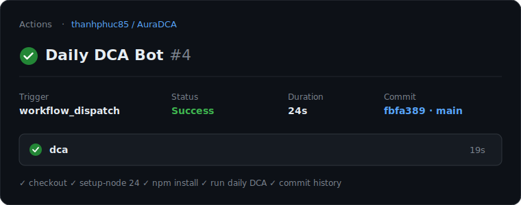

<p align="center">
  
</p>

<h1 align="center">Aura DCA</h1>

<p align="center"><em>An autonomous DCA agent — built on Arc Network.</em></p>

<p align="center">
  <a href="https://aura-dca.vercel.app"></a>
  <a href="https://github.com/thanhphuc85/AuraDCA/actions/workflows/dca.yml"></a>
  <a href="https://testnet.arcscan.app"></a>
  <a href="https://www.anthropic.com"></a>
  <a href="https://docs.arc.io/app-kit/swap.md"></a>
  <a href="https://www.typescriptlang.org"></a>
</p>

**🌐 Live dashboard:** **https://aura-dca.vercel.app** — connect your wallet (or sign in with email) to view your Arc Testnet balance, set your own DCA rate, chat with the agent, and watch its live on-chain track record.


> **An autonomous agent that lets Claude drive strategy while code owns every number that touches money.** A GitHub Actions cron asks **Claude** what to do, [`clampDecision()`](src/decision/guardrails.ts) re-derives the real limit from hard guardrails and owns the amount actually spent, and — because each user picks the token they DCA into — many users' schedules settle through **one pooled swap per token, distributed pro-rata** — executed on **Arc Testnet** via Circle's Swap Kit, authorised by each user's own signature, with the audit trail committed back to this repo. No server, no human in the loop, and no key ever leaves the user's wallet.
>
> Dollar-cost averaging into any token the network supports is the reference implementation. The architecture underneath is the point.

Built for the **Encode Club × Circle Programmable Money Hackathon** — full write-up: [`SUBMISSION.md`](SUBMISSION.md) · bản tiếng Việt: [`SUBMISSION.vi.md`](SUBMISSION.vi.md).

Every hour, a GitHub Actions cron job wakes up — and each user's own cadence decides whether this hour is one of theirs:

1. Checks the bot's Circle **Developer-Controlled Wallet** USDC balance on Arc Testnet.
2. Calls **Claude** (Anthropic API) to decide how much USDC to allocate to today's buy, given the remaining budget, day count, and recent trade history.
3. Clamps that recommendation against hard-coded guardrails in code (max per day, minimum reserve, minimum swap size, optional total campaign budget) — **Claude only recommends, the code decides**.
4. Groups the due users by the token each chose and executes **one USDC → token swap per group** via Circle's official [Swap Kit](https://docs.arc.io/app-kit/swap.md) SDK — the only officially documented swap path on Arc Testnet today (which currently wires cirBTC and EURC).
5. Appends a record to [`data/history.json`](data/history.json) and commits it back to the repo, so there's a visible audit trail over time.

Arc Testnet only supports Swap Kit swaps between USDC, EURC, and cirBTC — third-party community DEXs on Arc were deliberately avoided since they don't have publicly verified contract addresses.

The wallet is a Circle **Developer-Controlled Wallet**: Circle custodies the signing key server-side (via your API key + entity secret), so there's no raw private key to manage or leak in a GitHub Actions secret.

## Live demo — verified on-chain

This isn't a mockup. The flagship claim — **many users, one swap, settled pro-rata** — has executed on-chain, unsupervised:

- **Pooled 2-user swap:** [`0xd8a19f…1527`](https://testnet.arcscan.app/tx/0xd8a19fef1527ed91122ba29ec1ea9a845be1a7e3f3005450252f143956c07a19) — two wallets, 1 USDC each, pooled into one `2.00 USDC → 1.793953 EURC` swap and split 0.896977 / 0.896976 (50/50, to the last unit).
- **On-chain audit anchor:** the cron has written 14+ attestations of the committed ledger to [`AuraAttestation`](https://testnet.arcscan.app/address/0x4948c662630c7dE36BD59089085850c00996F661) — verify any of them read-only with `npm run verify-attest`.
- **The cron runs autonomously in CI:** see the green [Actions runs](https://github.com/thanhphuc85/AuraDCA/actions/workflows/dca.yml) and the bot's own `chore: record DCA run …` commits to [`data/history.json`](data/history.json).

### ⚠️ Current status: the cirBTC pair is in an Arc Testnet liquidity outage

`data/history.json` currently shows a run of `error_swap_failed` entries. That is
**not** the agent failing — Arc Testnet's `USDC → cirBTC` route has returned
*"No route available"* on every attempt for 14 distinct calendar days (2026-07-08 → 2026-07-23). Two things make
that verifiable rather than an excuse:

- **The execution path is provably live right now** — a real swap on a working
  pair, executed today: [`0xe54ee0…e3a3`](https://testnet.arcscan.app/tx/0xe54ee0951bed8c7263075b393af40e78606b88e763ce9dd8b7498d6c6a89e3a3)
  (`0.50 USDC → 0.402303 EURC`). Circle wallet → Swap Kit → Arc Testnet all work.
  Reproduce with `npm run prove-swap`.
- **The outage is isolated to cirBTC** — `npm run check-routes` probes every token
  symbol the SDK knows and reports that `EURC` quotes fine while `cirBTC` has no
  liquidity, and that every other asset (`WBTC`, `WETH`, `USDT`, …) isn't wired to
  Arc Testnet at all. Arc is stablecoin-native — even its native gas token is USDC
  — so **cirBTC is the only *volatile* asset on the chain** (EURC, the other
  target a user can pick, is a stablecoin).

Rather than burn fees on a dead route, the agent detects the structural outage,
reasons about it in its [reflections](data/reflections.json), reduces probe
frequency, and **withholds spend to preserve capital**. The DCA target is a
per-user choice: wallets set to cirBTC have the agent hold spend until the route
returns, while wallets set to EURC settle live now — no change required when
cirBTC recovers.

**Autonomous run in CI** — [verify live on the Actions tab →](https://github.com/thanhphuc85/AuraDCA/actions/workflows/dca.yml)



**The resulting on-chain swap** — [verify on ArcScan →](https://testnet.arcscan.app/tx/0x83097f432db9c013b3f8d7748b58f18484c2a5fde4ce500c221ee38524250933)


<sub>The two cards above summarize the real, independently verifiable events — the links are the source of truth.</sub>

Here's the shape of a `success` entry the agent records for a swap like the one above — the **on-chain transaction is the source of truth**, and `data/history.json` currently holds the `error_swap_failed` outage run described below, so this success record is shown here for reference, with Claude's own reasoning:

```jsonc
{
  "date": "2026-07-07",
  "status": "success",
  "requestedAmountUsdc": "0.10",   // what Claude proposed
  "clampedAmountUsdc": "0.100000", // what the code guardrails allowed
  "boundBy": "llm_recommendation", // which constraint bound the amount
  "tokenOut": "cirBTC",
  "reasoning": "Wallet balance (20 USDC) is well above the minimum reserve, no spend has occurred today, and this is day 1 with no campaign budget constraints noted. Proceeding with the max daily allowance of 0.10 USDC keeps a steady, smoothed pace without front-loading beyond guardrails.",
  "txHash": "0x83097f432db9c013b3f8d7748b58f18484c2a5fde4ce500c221ee38524250933",
  "explorerUrl": "https://testnet.arcscan.app/tx/0x83097f...50933",
  "amountOut": "0.00000012"
}
```

The agent also demonstrably **respects its own budget**: on a second same-day run it declined to trade — *"Already spent … today, which exceeds the maxDailyUsdc guardrail … Daily budget is exhausted"* — reading its own history and reasoning about it, not blindly firing.

## Why this is "agentic" (and safe)

The core design tension in an autonomous money bot: you want the flexibility of an LLM, but you cannot let an LLM be the final authority on how much to spend. This project resolves it with a strict split:

| | Claude (the agent) | `clampDecision()` (the code) |
|---|---|---|
| Role | **Recommends** an amount + reasoning | **Decides** the amount actually swapped |
| Input | Balance, day count, budget, recent history | Claude's recommendation + hard guardrails |
| Output | `{ proceed, amountUsdc, reasoning }` (validated via forced tool-use) | Clamped amount, or a skip with a recorded reason |
| Trust | Never trusted with the final number | Sole authority; pure function; unit-tested |

Every run records *which* constraint bound the outcome (`boundBy`), so the audit trail is transparent about whether Claude's own judgment or a hard cap drove the result. See [`src/decision/guardrails.ts`](src/decision/guardrails.ts).

## Architecture

```
src/
  config.ts          env parsing (zod) + guardrail defaults
  wallet.ts          Circle Developer-Controlled Wallets client + USDC balance getter
  decision/
    prompt.ts          context + system prompt sent to Claude
    client.ts          Anthropic tool-use call, zod-validated
    guardrails.ts      clampDecision() -- the real spending authority
    tools.ts           analysis tools Claude can call (pacing, dip ladder, risk, …)
    reflect.ts         post-run reflection: Claude writes an insight to memory
  swap/swapKit.ts    Circle Swap Kit execution via the Circle Wallets adapter (+ dry-run stub)
  price/priceFeed.ts real cirBTC price via Circle Swap Kit rates
  ledger/            per-user pooled + non-custodial (allowance) accounting
  history/store.ts   data/history.json read/append + budget math
  history/reflectionStore.ts  data/reflections.json — the agent's vector memory
  run.ts             orchestrator for one daily run
  index.ts           entrypoint, exit-code handling
api/                 Vercel serverless functions behind the dashboard (see below)
docs/index.html      the single-file dashboard (deployed to Vercel)
scripts/
  create-arc-wallet.mjs   one-off setup script: creates the wallet the bot signs with
```

## Dashboard & serverless API (Vercel)

Beyond the autonomous cron agent, the repo ships a full **dashboard** ([`docs/index.html`](docs/index.html)) deployed to **[aura-dca.vercel.app](https://aura-dca.vercel.app)**, backed by Vercel serverless functions in [`api/`](api). Users connect a wallet (EIP-6963 multi-wallet) or sign in with email, set their own DCA rate, and interact with the agent. Every state-changing action is authorized by an **EIP-191 wallet signature**, verified server-side.

| Endpoint | What it does |
|---|---|
| `api/set-dca-rate.ts` | Set a user's own daily DCA rate (signed; 0 = pause). |
| `api/run-dca.ts` | On-demand USDC → cirBTC swap for a user (signed; funds reserved and refunded on failure). |
| `api/withdraw.ts` | Real-time withdrawal of USDC/cirBTC back to the user's wallet (signed). |
| `api/chat.ts` | Claude assistant with tool calling — answers about treasury/trades and *proposes* sensitive actions (rate change, run DCA) for the user to confirm and sign. |
| `api/send-welcome.ts` | Sends a real welcome email on email sign-up (via [Resend](https://resend.com)). |

The dashboard also surfaces the agent's **vector memory** (per-run reflections) and an **Agent intelligence** panel (risk / regime / confidence / pattern alerts) derived from the run history.

**Vercel environment variables** (in addition to the Circle creds below): `GH_PAT` (commit ledger updates), `ANTHROPIC_API_KEY` (chat), `KIT_KEY` (on-demand swap), `RESEND_API_KEY` (welcome email). See [`.env.example`](.env.example) and [`DEPLOY.md`](DEPLOY.md).

## Prerequisites

- Node.js 20+
- A [Circle Developer Console](https://console.circle.com) account:
  - An **API key** (console.circle.com/api-keys).
  - An **entity secret** for Developer-Controlled Wallets, generated and registered from the console's Developer-Controlled Wallets setup screen.
- A Swap Kit `kitKey` from the Circle Developer Console (only required for real swaps, not for dry runs).
- An [Anthropic API key](https://console.anthropic.com).

## Local setup

```bash
npm install
cp .env.example .env
# fill in CIRCLE_API_KEY, CIRCLE_ENTITY_SECRET, KIT_KEY, ANTHROPIC_API_KEY

# create the wallet the bot will sign with, on Arc Testnet
npm run create-wallet
# copy the printed WALLET_ID into .env, then fund the printed address at
# https://faucet.circle.com (select Arc Testnet)

npm run typecheck
npm test

DRY_RUN=true npm start
```

A dry run performs the balance check and the real Claude decision call, but skips the actual swap and logs what *would* have happened.

## Guardrail configuration

All guardrails live in environment variables (see `.env.example`) and are enforced in [`src/decision/guardrails.ts`](src/decision/guardrails.ts), not trusted to the LLM:

| Variable | Meaning | Default |
|---|---|---|
| `MAX_DAILY_USDC` | Max USDC spend per day | `1.00` |
| `MIN_USDC_RESERVE` | USDC balance to always keep untouched | `0.50` |
| `MIN_SWAP_USDC` | Dust threshold below which a swap is skipped | `0.10` |
| `CAMPAIGN_TOTAL_BUDGET_USDC` | Optional overall cap across the whole campaign | unset |
| `CAMPAIGN_DURATION_DAYS` | Optional horizon Claude uses to pace spend | unset |
| `TOKEN_OUT` | Swap target token symbol | `cirBTC` |
| `DRY_RUN` | Skip the real swap when `true` | `true` |

## GitHub Actions setup

1. **Settings → Actions → General → Workflow permissions** → select **Read and write permissions** (required for the bot's history commit-back push).
2. **Settings → Secrets and variables → Actions → Secrets**, add:
   - `CIRCLE_API_KEY`
   - `CIRCLE_ENTITY_SECRET`
   - `WALLET_ID` (from `npm run create-wallet`)
   - `KIT_KEY`
   - `ANTHROPIC_API_KEY`
3. **Settings → Secrets and variables → Actions → Variables** (optional, all have code defaults), add any of `MAX_DAILY_USDC`, `MIN_USDC_RESERVE`, `MIN_SWAP_USDC`, `CAMPAIGN_TOTAL_BUDGET_USDC`, `CAMPAIGN_DURATION_DAYS`, `TOKEN_OUT`.
4. Set the `LIVE_TRADING_ENABLED` variable to `true` only when you're ready for the scheduled job to spend real testnet funds. Until then, both the scheduled and manual runs default to dry run — this is a deliberate second safety switch on top of the `dry_run` workflow input.

### Manual dry run

Go to the **Actions** tab → **Daily DCA Bot** → **Run workflow**, leave `dry_run` checked (default), and run it. Check the job logs and the updated `data/history.json` diff.

## Reading `data/history.json`

Each entry has a `status` field: `success` / `dry_run` for completed runs, `skipped_*` for routine no-ops (low balance, LLM declined, guardrail clamped to zero), and `error_*` for failures. `requestedAmountUsdc` is what Claude proposed; `clampedAmountUsdc` is what the guardrails actually allowed, with `boundBy` showing which constraint bound the result.

## The name and the mark

**Aura** is the product. **Arc** is the ground it stands on — never part of the name.

The mark is two orbits, crossing:

<p align="center">
  
</p>

It's the architecture, drawn. **Two independent paths — Claude's judgment and the
code's guardrails — meeting at every decision.** Claude reasons about the market
and proposes; [`clampDecision()`](src/decision/guardrails.ts) re-derives the limit
from hard rules and owns the number that actually gets spent. Neither orbit
contains the other. They only ever intersect at the moment a decision is made —
which is exactly where the safety of an LLM-driven money agent lives.

The second reading is the strategy itself: **orbits repeat.** They don't
accelerate on good news or flinch on bad. That indifference to noise is what
dollar-cost averaging *is* — and, during a 9-day route outage, it's what kept the
agent from spending into a dead market.

Violet fades to cyan along each path: judgment resolving into execution.

## Brand & trademark

**Aura DCA is an independent project built on Arc Network. It is not affiliated with, endorsed by, or a product of Circle.**

Checked against the [Arc brand guidelines and partner toolkit](https://www.arc.io/brand-guidelines-and-partner-toolkit)
([announcement](https://community.arc.io/home/blogs/arc-brand-guidelines-and-partner-toolkit-is-live-2026-07-16)) —
*"Your brand leads. Arc is the infrastructure."*

| Guideline | How this project complies |
|---|---|
| Don't incorporate Arc into a company name, product name, app icon, or brand system | The product is **Aura DCA**; the mark in [`docs/logo.svg`](docs/logo.svg) is original. "Arc" appears in neither. |
| Describe Arc only in the approved factual sense | We say *built on Arc Network*, *on Arc Testnet* — never as endorsement, partnership, or a joint product. |
| Use "Arc Network" on first mention, then "Arc" | Applied in this README, both submission write-ups, and the dashboard title. |
| Don't modify, recolor, distort, recreate, or overlay Arc brand assets | We use **no** Arc or Circle brand assets at all — the simplest way to honour this. |
| Arc's mark must not outweigh your own branding | Not applicable: Aura's is the only brand mark present. |

Circle may review or revoke Arc brand-asset usage at any time. If anything here still
reads as implied endorsement, we'll change it — contact the maintainer via the repo, or
Circle at the address in the guidelines above.

## Safety notes

- **Testnet only.** This targets Arc Testnet; there is no mainnet USDC or cirBTC at risk.
- The wallet is **Circle-custodied** (Developer-Controlled Wallet) — never commit `.env` or a real `CIRCLE_ENTITY_SECRET` to the repo.
- Guardrails (`clampDecision`) are the sole authority on spend amounts; Claude's output is only ever a recommendation.
