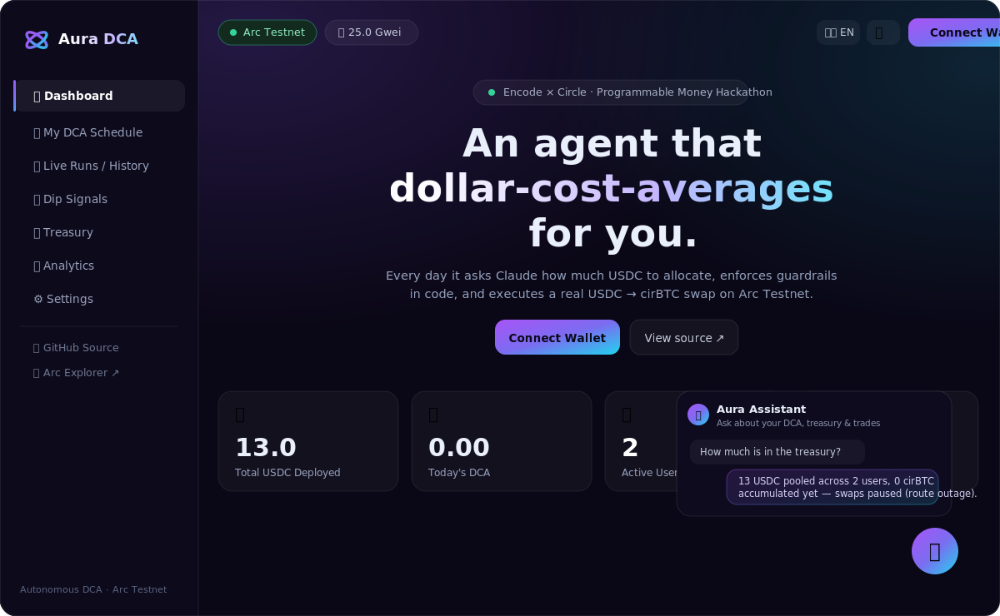

# Arc DCA Agent — Mô tả Submission

*Encode Club × Circle — Programmable Money Hackathon (build trên Arc)*

Repo: https://github.com/thanhphuc85/ArcDCA
Bằng chứng on-chain: https://testnet.arcscan.app/tx/0x83097f432db9c013b3f8d7748b58f18484c2a5fde4ce500c221ee38524250933

> 🇬🇧 English version: [`SUBMISSION.md`](SUBMISSION.md)

---

## Tagline

Một agent DCA (dollar-cost averaging) do LLM điều khiển, tự vận hành: mỗi ngày nó hỏi Claude nên phân bổ bao nhiêu USDC, áp giới hạn chi tiêu cứng bằng code, rồi thực hiện swap thật USDC → cirBTC trên Arc Testnet — không server, không cần con người can thiệp.

## Vấn đề

"Tài chính điều khiển bởi agent" là một trong những chủ đề chính của hackathon, nhưng nó ẩn chứa một mâu thuẫn thật sự: LLM rất giỏi phán đoán theo ngữ cảnh, nhưng bạn *không bao giờ* được để một mô hình ngôn ngữ làm người quyết định cuối cùng về việc chuyển bao nhiêu tiền. Trao toàn quyền cho nó thì chỉ một con số ảo giác cũng có thể vét sạch ví. Tước hết quyền tự chủ thì nó chỉ còn là một cron script rườm rà.

## Chúng tôi đã xây gì

Một bot DCA hàng ngày cho **cirBTC** trên **Arc Testnet**, giải quyết mâu thuẫn đó bằng một thiết kế hai tầng có chủ đích:

1. **Claude quyết định chiến lược.** Mỗi lần chạy, agent đưa cho Claude số dư ví hiện tại, số ngày đã DCA, ngân sách còn lại và lịch sử giao dịch gần đây, rồi hỏi — qua một tool call bắt buộc và được validate theo schema — hôm nay nên mua bao nhiêu USDC và tại sao. Đây là "agentic" thật sự: Claude đọc lịch sử của chính nó, dàn đều chi tiêu, và thậm chí **từ chối giao dịch** khi nhận ra ngân sách ngày đã hết.
2. **Code nắm giữ tiền.** Câu trả lời của Claude chỉ là *đề xuất*. Một hàm thuần túy, đã unit-test là `clampDecision()` mới là nơi duy nhất quyết định số tiền thực sự được swap — nó tự tính lại giới hạn từ các guardrail cứng (tối đa/ngày, số dư dự trữ tối thiểu, ngưỡng bụi, ngân sách chiến dịch tùy chọn) và không bao giờ tin vào phép tính của LLM. Mỗi lần chạy đều ghi lại *ràng buộc nào* đã giới hạn kết quả, nên nhật ký kiểm toán luôn minh bạch.

Bản thân giao dịch swap đi qua SDK **Swap Kit** chính thức của Circle — con đường swap duy nhất được document chính thức và khả dụng ổn định trên Arc Testnet (USDC / EURC / cirBTC). Ví là **Developer-Controlled Wallet** của Circle, nên không có private key thô nào để rò rỉ.

Toàn bộ chạy trên **GitHub Actions cron** — không cần server. Mỗi lần chạy commit kết quả ngược lại `data/history.json` trong repo, tạo ra một nhật ký kiểm toán công khai, chống chỉnh sửa, lớn dần theo thời gian.

### Dashboard — từ bot thành sản phẩm

Trên nền cron tự động, chúng tôi xây thêm một **dashboard** hoàn chỉnh (chạy tại **[arc-dca.vercel.app](https://arc-dca.vercel.app)**), biến agent thành thứ người dùng thật sự dùng được:



- **DCA per-user, non-custodial.** Người dùng kết nối ví (EIP-6963 đa ví) hoặc đăng nhập bằng email, tự đặt **tỉ lệ DCA hàng ngày** của mình; agent gộp lịch của mọi người vào mỗi lần chạy. Mọi thay đổi trạng thái (`đặt rate`, `chạy DCA ngay`, `rút tiền`) đều được ủy quyền bằng **chữ ký ví EIP-191** và verify trong serverless function trên Vercel — người dùng giữ quyền kiểm soát khóa của mình.
- **Agent hội thoại.** Trợ lý Claude (tool calling) trả lời "ngân quỹ còn bao nhiêu?", "giải thích giao dịch gần nhất"… từ dữ liệu on-chain thật; với action nhạy cảm nó chỉ **đề xuất** — người dùng xác nhận và ký trong UI trước khi thực thi.
- **Bộ nhớ vector + reflection.** Sau mỗi lần chạy Claude ghi một reflection vào `data/reflections.json`; dashboard hiển thị "bộ nhớ agent" này cùng bảng **Agent intelligence** (rủi ro / market regime / độ tự tin / pattern alerts) suy ra từ lịch sử chạy.
- **Đa agent.** Một market-analyst chạy Claude Haiku tạo bản tóm tắt thị trường mà agent quyết định chính đưa vào cân nhắc phân bổ.

## Cách hoạt động (luồng)

```
GitHub Actions cron (hàng ngày)
  → đọc số dư USDC của ví Circle trên Arc Testnet
  → Claude quyết định: { proceed, amountUsdc, reasoning }   (forced tool-use, validate bằng zod)
  → clampDecision(): guardrail cứng áp số tiền thật sự
  → Circle Swap Kit: swap USDC → cirBTC (hoặc dry-run)
  → ghi vào data/history.json  →  commit ngược lại repo
```

## Công nghệ

- **TypeScript / Node.js**, chạy trực tiếp bằng `tsx` (không cần build step)
- **Anthropic Claude** (`@anthropic-ai/sdk`) — bộ máy ra quyết định, qua forced tool-use + validate zod
- **Circle Swap Kit** (`@circle-fin/swap-kit`) + **Developer-Controlled Wallets** (`@circle-fin/developer-controlled-wallets`) + Circle Wallets adapter
- **Arc Testnet** (L1 EVM stablecoin-native của Circle; gas trả bằng USDC)
- **GitHub Actions** cho lịch chạy, secrets và nhật ký kiểm toán commit-back
- **Vitest** unit test cho phần logic guardrail quan trọng về an toàn
- **Vercel** serverless (`api/`) cho các action có ký của dashboard — set-rate, run-DCA, rút tiền, chat, email chào mừng
- **Dashboard một file** (`docs/index.html`) — phát hiện ví EIP-6963, ký EIP-191, song ngữ Anh/Việt, sáng/tối

## Điểm nổi bật

- **Thực thi thật, kiểm chứng được** — không phải video demo. Có giao dịch on-chain thật và các CI run xanh mà ai cũng kiểm tra được.
- **Kiến trúc an toàn** — sự phân tách "LLM đề xuất / code quyết định" chính là cốt lõi, được thực thi bằng một hàm thuần đã test cộng cơ chế hai công tắc cho giao dịch thật (`DRY_RUN` + `LIVE_TRADING_ENABLED`).
- **Tự chủ thật sự** — tự host trên CI miễn phí, tự lưu lịch sử qua commit, và biết lý luận dựa trên các lần chạy trước của chính nó.

## Khó khăn đã gặp

- **Arc Testnet không có "altcoin thật"** — các DEX cộng đồng (ArcSwap/Presto/…) không có địa chỉ contract được xác minh công khai, nên chúng tôi chủ động chuẩn hóa theo Swap Kit chính thức của Circle (USDC↔EURC↔cirBTC) để submission thật sự chạy được.
- **Đóng gói SDK của Circle** — yêu cầu Node ≥ 22 và có những đặc thù ESM named-export chỉ lộ ra trên một số phiên bản Node nhất định; đã ghim CI về Node 24 để khớp môi trường đã kiểm chứng.
- **Config chuỗi rỗng trong CI** — biến GitHub Actions chưa set sẽ đến dưới dạng `""`, mà `.default()` của zod không lấp `""`; đã sửa bằng bước tiền xử lý chuyển rỗng thành undefined.

## Hướng phát triển tiếp

- DCA đa tài sản (chia giữa cirBTC / EURC theo tỷ lệ do Claude quyết định)
- Bảng P&L / giá vốn trực tiếp — markup dashboard đã sẵn, tự bật khi các swap cirBTC thành công (route USDC→cirBTC trên Arc Testnet đang gặp outage mà agent vẫn lý luận xoay quanh)
- Verify domain gửi email để email chào mừng tới được mọi user, không chỉ hộp thư người vận hành
- Rà soát sẵn sàng cho mainnet khi Arc mainnet ra mắt

> Kể từ submission đầu, chúng tôi phát triển từ một bot cron không giao diện thành sản phẩm dùng được: dashboard per-user non-custodial, trợ lý Claude hội thoại với action xác-nhận-rồi-ký, rút tiền thời gian thực và DCA theo yêu cầu, cùng bộ nhớ vector của chính agent — tất cả vẫn nằm dưới cùng một guardrail "code nắm giữ tiền".

## Lưu ý an toàn

Chỉ testnet. Token là token faucet không có giá trị. Guardrail được thực thi bằng code, không phải bởi mô hình; giao dịch thật cần bật hai công tắc riêng biệt.
