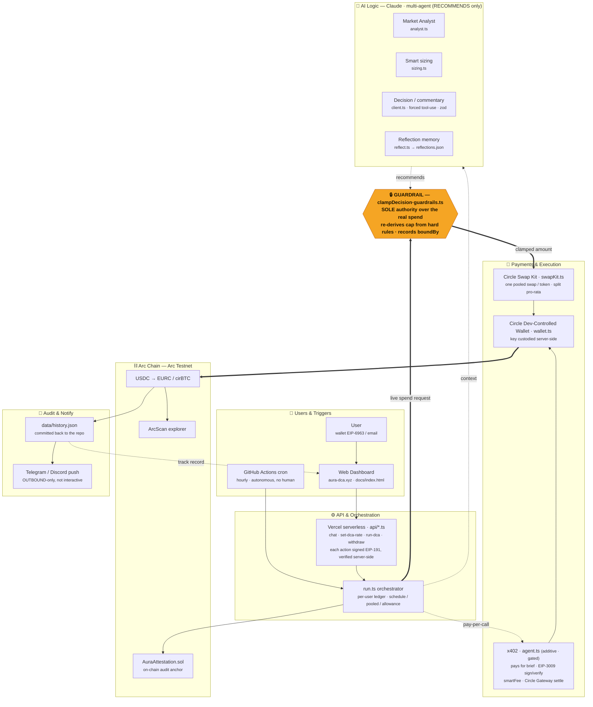

# Aura DCA — Architecture

> 🇻🇳 Tiếng Việt: [`architecture.vi.md`](architecture.vi.md)

Data flow & money flow of the autonomous DCA agent on Arc Network.
Core principle: **Claude *recommends*, code (`clampDecision`) *decides* the number that actually gets spent.**

## Reading the diagram

| Symbol | Meaning |
|---|---|
| **Bold solid** (`==>`) | Authoritative money flow: request → guardrail → swap → chain |
| **Dashed** (`-.->`) | Advisory / additive: AI only recommends, x402 pay-per-call, feedback to the dashboard |
| 🔒 Amber block | `clampDecision()` — the safety gate where the LLM's *judgment* and the code's *guardrails* intersect |

**Two real entry points:** the Web Dashboard (user-initiated) and the GitHub Actions cron (autonomous, hourly).
Telegram/Discord are **outbound push notifications only** — not an interactive bot.
