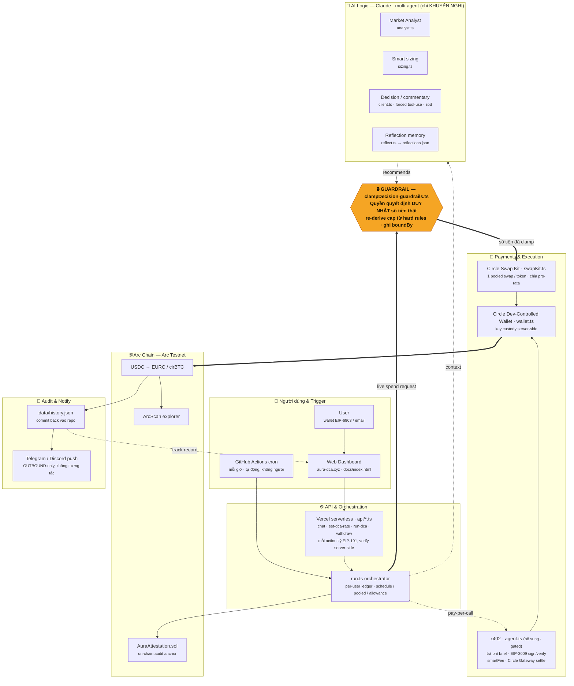

# Aura DCA — Sơ đồ kiến trúc

> 🇬🇧 English: [`architecture.md`](architecture.md)

Luồng dữ liệu & luồng tiền của agent DCA tự động trên Arc Network.
Nguyên tắc cốt lõi: **Claude *khuyến nghị*, code (`clampDecision`) *quyết định* con số thật sự được chi.**

## Đọc sơ đồ

| Ký hiệu | Ý nghĩa |
|---|---|
| **Nét liền đậm** (`==>`) | Luồng tiền có thẩm quyền: request → guardrail → swap → chain |
| **Nét đứt** (`-.->`) | Cố vấn / bổ sung: AI chỉ khuyến nghị, x402 pay-per-call, feedback về dashboard |
| 🔒 Khối cam | `clampDecision()` — chốt an toàn, nơi *phán đoán của LLM* và *guardrail của code* giao nhau |

**Hai entry point thật:** Web Dashboard (người dùng chủ động) + GitHub Actions cron (tự động mỗi giờ).
Telegram/Discord **chỉ nhận thông báo outbound**, không phải bot tương tác.
